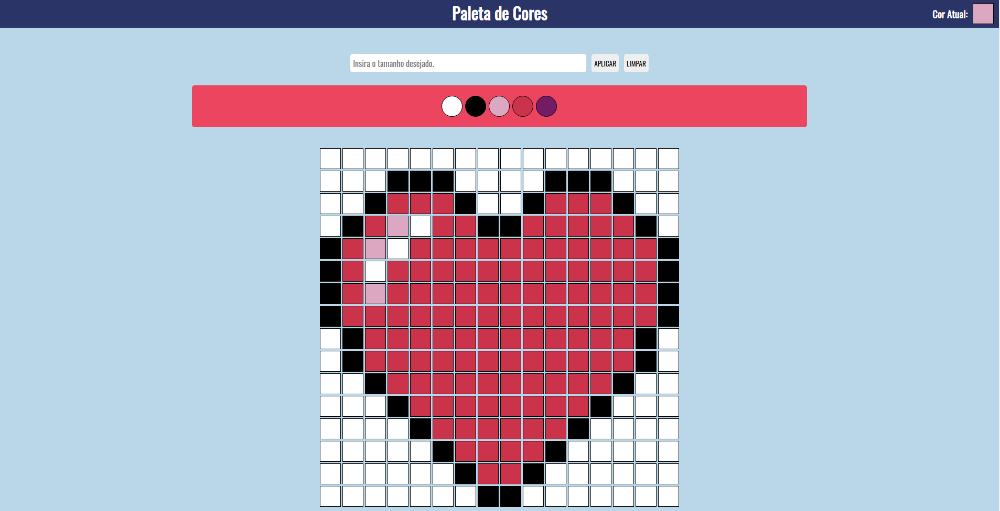

# Sejam Bem-vindo ao projeto Pixels Art com React!! 🤩 🖌️

#### Esse projeto tem como objetivo propor um quadro de pixel arte onde o usuário pode selecionar uma das cores disponiveis na paleta e pintar o quadro do modo que desejar, tendo também as opções de limpar o quadro é escolher o tamanho do mesmo. Além de ter uma paleta de cores aleátoria disponivél toda vez que é recarregado a página. Já havia feito esse projeto com Java Script Vanilla mas decidi recria-lo com React.

  

## Tecnologias :

<ul>
  <li>HTML</li>
  <li>CSS</li>
  <li>Java Script</li>
  <li>React</li>
</ul>

## Funcionalidades:

- Possível escolher o tamanho do quadro.
- Possivel observar cor atual que está pintando.
- Possível escolher entre 5 cores onde 3 são aleatórias toda vez que é carregado a página.
- Possível limpar o quadro para a cor padrão (branco).

## Como executar:

- Clone em seu computador (via SHH).
- Abra um novo terminal em seu VSCode.   
- Execute o comando para instalar dependências: `npm install`.
- Para incializar execute o comando: `npm start`.

## Também disponível em:

### <a href="https://pixels-art-whit-react-80ahwhj6c-cozmu.vercel.app/" ><b>Pixels Art Com React</b></a>

## Como contribuir no projeto:
  1. Faça um **fork** do projeto;
  2. Crie uma nova branch com as suas alterações: `git checkout -b my-feature`;
  3. Salve as alterações e crie uma mensagem de commit contando o que você fez: `git commit -m "feature: My new feature"`;
  4. Envie as suas alterações: `git push origin my-feature`;
  5. Abra o seu pull-request na página do GitHub.  

## Licença:

 Esse projeto está sob a licença: 

 

 ##  Autor:

### <a href="https://www.linkedin.com/in/jorge-reis-dev/" ><b>Jorge Wellington.</b></a>
